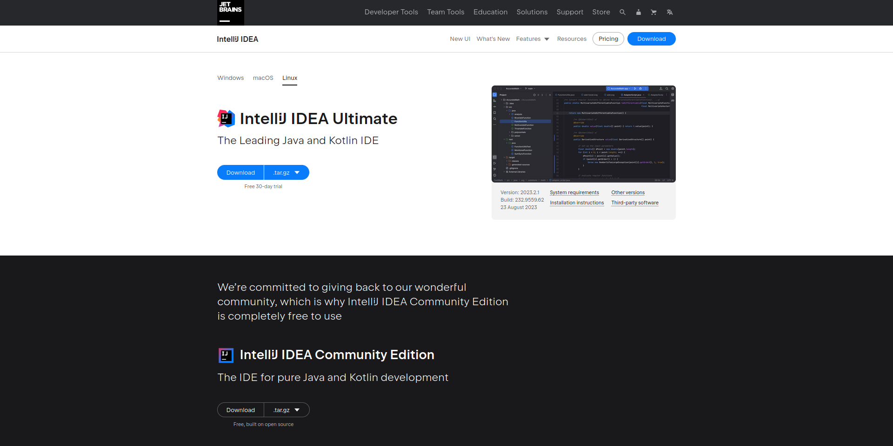
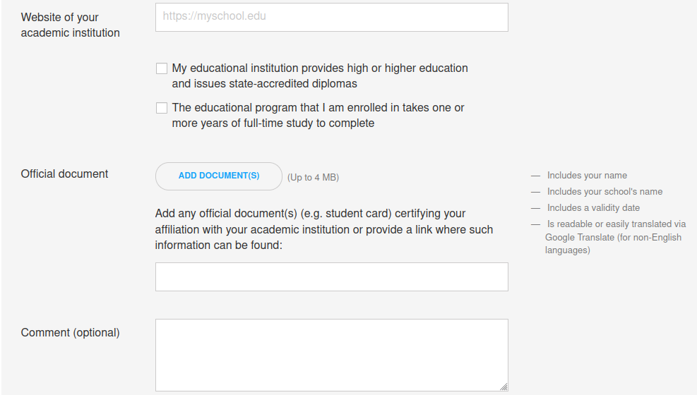
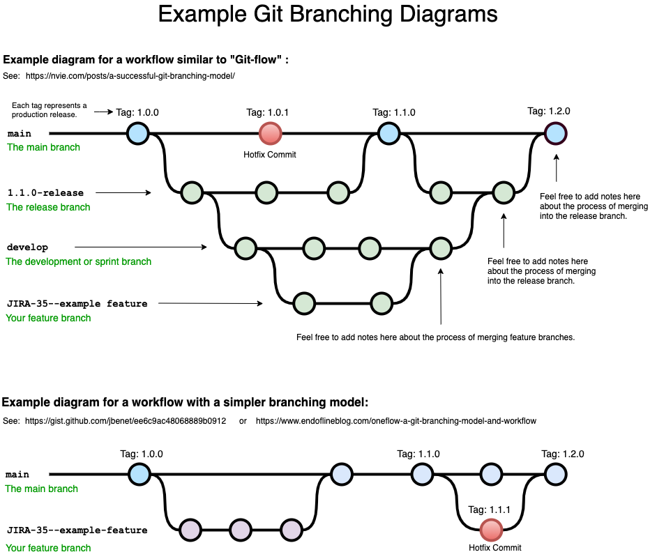
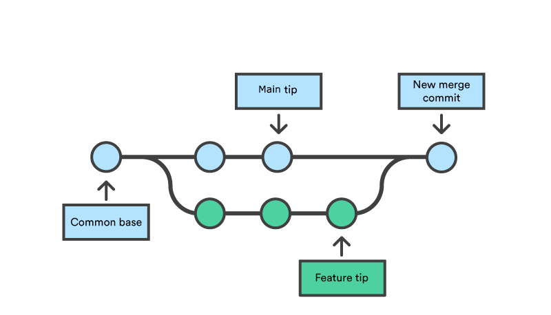
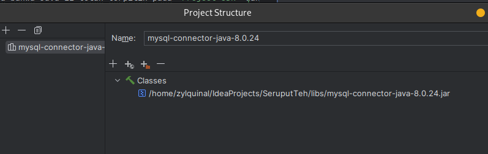
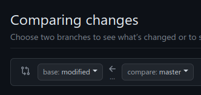
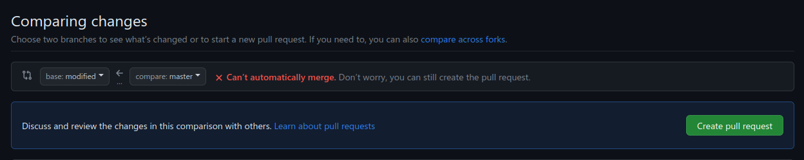
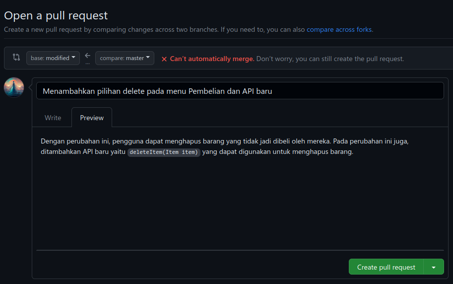

# SeruputTeh

## Anggota

- Muhammad Stiven Pratama (2602225271)

> Note: Add yourself using `git`

## Cara Setup

### 1. **Download & Install the IDE**

Di sini kita akan menggunakan IDE yang bernama [IntelliJ IDEA Community Edition](https://www.jetbrains.com/idea/download/)



Setelah selesai di download, install seperti biasa.

#### But... i want to use the Ultimate Edition!!! I want all the cool features!!!

Oke baik, jika kamu ingin menggunakan Ultimate Edition, kamu melakukan aplikasi
sebagai siswa pada link [berikut](https://www.jetbrains.com/shop/eform/students). Melalui aplikasi ini, kamu dapat
mendapatkan lisensi gratis untuk menggunakan IntelliJ IDEA Ultimate Edition.

**Tetapi** karena [saat ini](https://github.com/JetBrains/swot/pull/18468#issuecomment-1705051873), email `binus.ac.id` masuk ke _stoplist_ JetBrains, maka kamu tidak dapat secara
langsung mendaftar menggunakan email `binus.ac.id`. Untuk dapat mendaftar menggunakan email `binus.ac.id`, kamu
perlu menggunakan metode pendaftaran `Official Document`.



Pada menu ini kamu dapat melihat bahwa kamu dapat mendaftar menggunakan metode `Official Document`. Metode ini
digunakan untuk mendaftar menggunakan dokumen resmi yang dikeluarkan oleh institusi pendidikan tempat kamu belajar.

Untuk melakukannya, perhatian beberapa hal penting yang harus kamu perhatikan

- **Email**: Email binus.ac.id kamu
- **Website of your academic institution**: https://binus.ac.id
- Centang **My educational institution provides high or higher education
  and issues state-accredited diplomas**
- Centang **The educational program that I am enrolled in takes one or
  more years of full-time study to complete**
- **Official document**: Foto Kartu Binusian kamu
- **Official Document (Text)**: https://binus.ac.id/general-facilities-binusian-card/

Setelah selesai, kamu dapat mengirimkan aplikasi tersebut. Setelah selesai, kamu dapat menunggu hingga aplikasi kamu
disetujui oleh tim JetBrains. Jika aplikasi kamu disetujui oleh tim JetBrains, maka kamu akan menerima email dari
JetBrains yang berisi tentang lisensi gratis untuk menggunakan IntelliJ IDEA Ultimate Edition.

> Biasanya kamu akan menerima email dari JetBrains dalam waktu 1-2 minggu.

### 2. **Install Git**

Apa itu Git? Git adalah salah satu Version Control System (VCS) yang paling populer saat ini. Git digunakan untuk 
mengelola perubahan-perubahan pada _source code_ secara efisien dan efektif. Git juga mendukung pengembangan non-linear, 
dimana tim pengembang dapat bekerja secara parallel pada branch yang berbeda-beda.

> Tapi kenapa kita harus menggunakan Git? Bukankah kita bisa menggunakan IDE untuk mengelola perubahan pada _source code_?
> Ada beberapa alasan kenapa kita harus menggunakan Git, diantaranya:
> - Git memungkinkan kita untuk mengembalikan _source code_ ke versi sebelumnya
> - Git memungkinkan kita untuk mengembangkan _source code_ secara bersamaan dengan tim
> - Git memungkinkan kita untuk mengembangkan _source code_ secara offline
> - Git memungkinkan kita untuk mengembangkan _source code_ secara non-linear
> - Git memungkinkan kita untuk mengembangkan _source code_ secara _branching_ dan _merging_

 #### Apa itu branch di Git?

 Branch adalah sebuah fitur yang memungkinkan kita untuk mengembangkan _source code_ secara non-linear.
 Dengan branch, kita dapat mengembangkan _source code_ tanpa mengganggu _source code_ yang sedang dikembangkan oleh tim lain.
 Setelah selesai, kita dapat menggabungkan _source code_ yang telah dikembangkan dengan _source code_ yang sedang dikembangkan oleh tim lain.
 Dengan branch, kita dapat mengembangkan _source code_ secara bersamaan dengan tim.



#### Apa itu merge di Git?

Merge adalah sebuah fitur yang memungkinkan kita untuk menggabungkan _source code_ yang telah dikembangkan dengan 
_source code_ yang sedang dikembangkan oleh tim lain. Dengan merge, kita dapat menggabungkan _source code_ yang telah
dikembangkan dengan _source code_ yang sedang dikembangkan oleh tim lain.



### Oke, tapi apa perbedaan Git dengan GitHub?

Git adalah salah satu Version Control System (VCS) yang paling populer saat ini. Git digunakan untuk
mengelola perubahan-perubahan pada _source code_ secara efisien dan efektif. Git juga mendukung pengembangan non-linear,
dimana tim pengembang dapat bekerja secara parallel pada branch yang berbeda-beda.

GitHub adalah layanan _hosting_ untuk Git. GitHub memungkinkan kita untuk menyimpan _source code_ secara _remote_.
GitHub juga memungkinkan kita untuk berkolaborasi dengan tim pengembang lainnya.


### Download

Download: [git-scm.com](https://git-scm.com/downloads)

### Install

Install seperti biasa.

> Note: Pada saat instalasi Git, kamu akan ditanya untuk memilih _text editor_ yang akan digunakan oleh Git.
> Pilih saja _text editor_ yang biasa kamu gunakan, misalnya Notepad++ atau Sublime Text.

### Setting up Credential

Setelah selesai menginstall Git, kita perlu mengatur _credential_ Git. _Credential_ Git digunakan untuk mengidentifikasi
pengguna Git. _Credential_ Git terdiri dari _username_ dan _email_. _Username_ dan _email_ yang digunakan harus sama
dengan _username_ dan _email_ yang digunakan pada GitHub.

Untuk mengatur _credential_ Git, buka _command prompt_ dan ketikkan perintah berikut:

```bash
$ git config --global user.name "YOUR_USERNAME"
$ git config --global user.email "YOUR_EMAIL"
```
_YOUR_USERNAME_ dan _YOUR_EMAIL_ diganti dengan _username_ dan _email_ yang digunakan pada GitHub.

Setelah berhasil, kita selanjutkan akan login ke GitHub menggunakan Git. Pada tutorial kali ini saya akan
menganggap bahwa kamu sudah memiliki akun GitHub dan menggunakan OS Windows.

### Login to GitHub using Git
```bash
$ git config --global credential.helper wincred
```

Apa itu `wincred`? `wincred` adalah sebuah _credential helper_ yang digunakan untuk menyimpan _credential_ Git pada
Windows Credential Manager. Dengan menggunakan `wincred`, kita tidak perlu lagi memasukkan _username_ dan _password_
GitHub setiap kali kita melakukan _push_ atau _pull_.

### 3. **Clone the repository**

Jika kamu ingin mengunduh _source code_ dari repository ini, kamu dapat menggunakan perintah `git clone` seperti berikut:

```bash
git clone https://github.com/Zylquinal/SeruputTeh.git
```

Atau jika kamu ingin menggunakan _GUI_ untuk mengunduh _source code_ dari repository ini, kamu dapat menggunakan fitur
baru dari IntelliJ IDEA. Caranya adalah sebagai berikut:
1. Buka IntelliJ IDEA
2. Pilih menu `File` > `New` > `Project from Version Control...`
3. Pilih `Git`
4. Masukkan URL repository ini (`https://github.com/Zylquinal/SeruputTeh.git`)
5. Pilih direktori tempat kamu ingin menyimpan _source code_ dari repository ini
6. Klik `Clone`
7. Tunggu hingga proses _cloning_ selesai
8. Selesai

Tetapi jika kamu berada di _dashboard_ Intellij IDEA dan tidak dapat menemukannya
kamu dapat menggunakan fitur `Get from Version Control` yang terletak di pojok kanan atas.

### 4. **Setting up the project**

Setelah berhasil mengkloning repository ini, kita perlu mengatur _project_ ini agar dapat dijalankan di komputer kita.

#### 4.1. **Install JDK**

JDK adalah singkatan dari Java Development Kit. JDK digunakan untuk mengembangkan aplikasi berbasis Java.
JDK juga digunakan untuk menjalankan aplikasi berbasis Java. JDK terdiri dari JRE dan _tools_ pengembangan Java.

Untuk project ini kita akan menggunakan JDK versi 11. JDK versi 11 dapat diunduh di [sini](https://www.oracle.com/java/technologies/javase-jdk11-downloads.html). Tetapi
jika kamu inggin menggunakan implementasi lain dari JDK versi 11, kamu dapat mendownloadnya melalui halaman berikut:
1. [AdoptOpenJDK (Recommended by me)](https://adoptium.net/temurin/releases/?version=11&os=any)
2. [Amazon Corretto](https://docs.aws.amazon.com/corretto/latest/corretto-11-ug/downloads-list.html)
3. [Azul Zulu](https://www.azul.com/downloads/zulu-community/?version=java-11-lts&os=windows&architecture=x86-64-bit&package=jdk)
4. [BellSoft Liberica](https://bell-sw.com/pages/downloads/#/java-11-lts)
5. [IBM Semeru](https://developer.ibm.com/languages/java/semeru-runtimes/downloads/)
6. [OpenJDK](https://jdk.java.net/java-se-ri/11)
7. [Oracle JDK](https://www.oracle.com/java/technologies/javase-jdk11-downloads.html)
8. [Red Hat OpenJDK](https://developers.redhat.com/products/openjdk/download)
9. [SAP Machine](https://github.com/SAP/SapMachine/releases/tag/sapmachine-11.0.20.1)

Apa perbedaan dari semua implementasi JDK di atas? Secara garis besar, tidak ada perbedaan yang signifikan antara
semua implementasi JDK di atas. Semua implementasi JDK di atas adalah implementasi dari OpenJDK. Perbedaan utama
dari semua implementasi JDK di atas adalah lisensi yang digunakan. Beberapa implementasi JDK di atas menggunakan
lisensi yang berbeda-beda. 

Untuk lebih jelasnya, kamu dapat membaca [halaman ini](https://www.baeldung.com/oracle-jdk-vs-openjdk).
Untuk project ini, saya merekomendasikan untuk menggunakan [AdoptOpenJDK](https://adoptium.net/temurin/).
AdoptOpenJDK adalah implementasi dari OpenJDK yang menggunakan lisensi yang sama dengan OpenJDK.
AdoptOpenJDK juga mendukung berbagai macam OS dan arsitektur.

**Baik, tapi apa maksud dari implementasi?**

Implementasi adalah sebuah proses dimana kita mengimplementasikan sebuah spesifikasi. Dalam hal ini, kita mengimplementasikan
spesifikasi Java. Implementasi Java yang paling populer saat ini adalah OpenJDK. OpenJDK adalah sebuah proyek open-source
yang dikembangkan oleh Oracle. OpenJDK adalah implementasi dari spesifikasi Java. OpenJDK juga merupakan implementasi 
Java yang paling populer saat ini. OpenJDK juga merupakan implementasi Java yang paling banyak digunakan saat ini.

Jika kamu masih bingung, kamu dapat melihat apa maksud dari [**spesifikasi**](https://docs.oracle.com/javase/specs/jls/se11/jls11.pdf).
Spesifikasi Java adalah sebuah dokumen yang berisi tentang aturan-aturan yang harus diikuti oleh implementasi Java.
Hal ini dapat kamu bayangkan sebagai sebuah ide. Ide tersebut dapat diimplementasikan oleh siapa saja. Tetapi
implementasi tersebut harus mengikuti aturan-aturan yang telah ditetapkan oleh spesifikasi Java.

Jika ada perbedaan antara implementasi Java dengan spesifikasi Java, maka implementasi Java tersebut tidak dapat
disebut sebagai implementasi Java. Implementasi Java tersebut hanya dapat disebut sebagai implementasi Java jika
implementasi Java tersebut mengikuti aturan-aturan yang telah ditetapkan oleh spesifikasi Java.

#### 4.2. **Mengatur JDK pada IntelliJ IDEA**

Setelah berhasil menginstall JDK, kita perlu mengatur JDK pada IntelliJ IDEA. Caranya adalah sebagai berikut:
1. Buka IntelliJ IDEA
2. Pilih menu `File` > `Project Structure...`
3. Pilih `Project`
4. Pilih `SDK`
5. Pilih Java versi 11 yang telah kamu install sebelumnya

**Saya sudah menginstall, tetapi Java 11 masih belum muncul**

Jika Java 11 masih belum muncul, maka kita perlu menambahkan Java 11 secara manual. Caranya adalah sebagai berikut:
1. Pilih menu `File` > `Project Structure...`
2. Pilih `Project`
3. Pilh `SDK`
4. Klik `+`
5. Pilih `JDK`
6. Pilih direktori dimana kamu menginstall Java 11

> Note: Di Windows, Java 11 biasanya terinstall di `C:\Program Files\Java\jdk...`
> Jika kamu tidak menemukan direktori tersebut, maka kamu dapat mencari direktori tersebut secara manual.
> Jika kamu masih tidak menemukan direktori tersebut, maka kamu dapat menginstall Java 11 kembali.

Selain itu, pastikan juga bahwa Java 11 telah terpilih pada `Project SDK` dan `Project language level`.
Jika belum, maka pilih Java 11 pada `Project SDK` dan `Project language level`.


#### 4.3. **Menambahkan library _mysql-connector-java_ pada project**

Untuk dapat menggunakan MySQL pada project ini, kita perlu menambahkan library _mysql-connector-java_ pada project ini.
Caranya adalah sebagai berikut:

1. Buka IntelliJ IDEA
2. Pilih menu `File` > `Project Structure...`
3. Pilih `Libraries`
4. Klik `+`
5. Pilih `Java`
6. Pilih file `mysql-connector-java-8.0.24.jar` yang terletak di folder _libs_
7. Klik `OK`


> Note: Library mysql-connector-java sudah disediakan di folder _libs_



### 5. **Menginstall database**

Database yang digunakan pada project ini adalah MySQL. Untuk dapat menggunakan MySQL pada project ini, kita perlu
menginstall MySQL terlebih dahulu. Ada beberapa cara untuk menginstall MySQL, diantaranya:

### Menggunakan XAMPP

XAMPP adalah sebuah aplikasi yang digunakan untuk menginstall Apache, MariaDB, PHP, dan Perl. XAMPP juga digunakan
untuk menginstall phpMyAdmin. phpMyAdmin adalah sebuah aplikasi yang digunakan untuk mengelola database MySQL.
XAMPP dapat diunduh di [sini](https://www.apachefriends.org/download.html).

### Saya tidak ingin menggunakan XAMPP, apa ada cara lain?

Tentunya ada. Kamu dapat menginstall MySQL secara manual. MySQL dapat diunduh di [sini](https://dev.mysql.com/downloads/mysql/).
Ataupun jika kamu ingin menggunakan Docker, kamu dapat menggunakan Docker image MySQL. Docker image MySQL dapat diunduh di [sini](https://hub.docker.com/_/mysql).
Tetapi pada tutorial kali ini, saya akan menggunakan XAMPP.

### 6. **Setting up the database**

Setelah selesai menginstall MySQL, kita perlu mengatur database yang akan digunakan oleh project ini. Pada tutorial ini
saya akan menggunakan phpMyAdmin untuk mengatur database yang akan digunakan oleh project ini. Caranya adalah sebagai berikut:

1. Buka XAMPP
2. Klik `Start` pada bagian `Apache` dan `MySQL`
3. Buka browser dan masukkan URL `http://localhost/phpmyadmin/`
4. Klik `New`
5. Masukkan nama database yang akan digunakan oleh project ini, yaitu `seruput_teh`

Setelah selesai membuat database, kita berikutnya perlu mengatur tabel yang akan digunakan oleh project ini. Tetapi tenang
saja, kita tidak perlu membuat tabel secara manual. Kita dapat menggunakan _script_ yang telah disediakan. Kamu dapat
melihat _script_ yang telah disediakan di folder `script`. _Script_ tersebut dapat dijalankan di phpMyAdmin. Caranya adalah

1. Buka phpMyAdmin
2. Pilih database `seruput_teh`
3. Pilih menu `SQL`
4. Masukkan _script_ yang ingin dijalankan
5. Klik `Go`
6. Selesai


## Cara menggunakan Git di _Project_ ini

### How to create a new branch

Jika kita mengacu pada _best-practice_ yang umumnya digunakan oleh orang - orang yang menggunakan Git, kita tidak
dianjurkan untuk mengembangkan _source code_ di _branch_ `master`. _Branch_ `master` adalah _branch_ yang digunakan
untuk menyimpan _source code_ yang telah selesai dikembangkan. _Branch_ `master` juga digunakan untuk menyimpan _source code_
yang telah di-_release_.

Jika kita mengembangkan _source code_ di _branch_ `master`, maka kita akan mengalami beberapa masalah, diantaranya:
- Kita tidak dapat mengembangkan _source code_ secara bersamaan dengan tim
- Kita tidak dapat mengembangkan _source code_ secara non-linear
- Kita tidak dapat mengembangkan _source code_ secara _branching_ dan _merging_
- Kita tidak dapat mengembangkan _source code_ tanpa mengganggu _source code_ yang sedang dikembangkan oleh tim lain

Oleh karena itu kita perlu membuat _branch_ baru untuk mengembangkan _source code_. Kamu dapat
membuat _branch_ baru dengan menggunakan perintah `git checkout -b <branch-name>`. Contoh penggunaan perintah tersebut

```bash
$ git checkout -b <branch-name>
```

`<branch-name>` diganti dengan nama _branch_ yang ingin kamu buat. Contoh penggunaan perintah tersebut

```bash
$ git checkout -b add-new-feature

$ git checkout -b fix-bug

$ git checkout -b update-documentation

$ git checkout -b remove-unused-code

$ git checkout -b ilham-branch
```

### How to switch to another branch

Terkadang kita ingin mengembangkan _source code_ yang telah dikembangkan oleh tim lain. Untuk dapat mengembangkan
_source code_ yang telah dikembangkan oleh tim lain, kita perlu mengubah _branch_ yang sedang kita gunakan.
Kamu dapat mengubah _branch_ yang sedang kamu gunakan dengan menggunakan perintah `git checkout <branch-name>`.
Contoh penggunaan perintah tersebut

```bash
$ git checkout <branch-name>
```

`<branch-name>` diganti dengan nama _branch_ yang ingin kamu gunakan. Contoh penggunaan perintah tersebut

```bash
$ git checkout master

$ git checkout ilham-branch
```

### How to add your changes

Setelah selesai mengembangkan _source code_, kita perlu menyimpan perubahan-perubahan yang telah kita buat.
Kita dapat menyimpan perubahan-perubahan yang telah kita buat dengan menggunakan perintah `git add .`.

```bash
$ git add .
```

Apa itu `git add .`? `git add .` adalah sebuah perintah yang digunakan untuk menambahkan perubahan-perubahan yang telah
kita buat ke _staging area_. _Staging area_ adalah sebuah tempat dimana kita dapat melihat perubahan-perubahan yang telah
kita buat. _Staging area_ juga digunakan untuk menyimpan perubahan-perubahan yang telah kita buat sebelum kita menyimpan
perubahan-perubahan tersebut ke _repository_.

### How to commit your changes

Setelah selesai mengembangkan _source code_, kita perlu menyimpan perubahan-perubahan yang telah kita buat.
Kita dapat menyimpan perubahan-perubahan yang telah kita buat dengan menggunakan perintah `git commit -m "<commit-message>"`.

```bash
$ git commit -m "<commit-message>"
```

`<commit-message>` diganti dengan pesan yang ingin kamu sampaikan. Contoh penggunaan perintah tersebut

```bash
$ git add .
$ git commit -m "Add new feature"
```

> Note: Jangan lupa menggunakan `git add .` sebelum menggunakan `git commit -m "<commit-message>"` untuk menyimpan 
> perubahan-perubahan yang telah kamu buat.

### How to push your changes

Setelah selesai mengembangkan _source code_, kita perlu menyimpan perubahan-perubahan yang telah kita buat.
Kita dapat menyimpan perubahan-perubahan yang telah kita buat dengan menggunakan perintah `git push origin <branch-name>`.

```bash
$ git push origin <branch-name>
```

`<branch-name>` diganti dengan nama _branch_ yang ingin kamu gunakan. Contoh penggunaan perintah tersebut

```bash
$ git push origin master

$ git push origin ilham-branch
```

### How to pull changes from another branch

Terkadang kita ingin mengembangkan _source code_ yang telah dikembangkan oleh tim lain. Untuk dapat mengembangkan
_source code_ yang telah dikembangkan oleh tim lain, kita perlu mengubah _branch_ yang sedang kita gunakan. 
Kamu dapat mengubah _branch_ yang sedang kamu gunakan dengan menggunakan perintah `git pull origin <branch-name>`.
Contoh penggunaan perintah tersebut

```bash
$ git pull origin <branch-name>
```

`<branch-name>` diganti dengan nama _branch_ yang ingin kamu gunakan. Contoh penggunaan perintah tersebut

```bash
$ git pull origin master

$ git pull origin ilham-branch
```

### How to see the changes

Terkadang kita ingin melihat perubahan-perubahan yang telah kita buat. Untuk dapat melihat perubahan-perubahan yang telah
kita buat, kita dapat menggunakan perintah `git status`.

```bash
$ git status
```

### How to see the differences

Terkadang kita ingin melihat perbedaan antara _source code_ yang telah kita buat dengan _source code_ yang telah kita
simpan di _repository_. Untuk dapat melihat perbedaan antara _source code_ yang telah kita buat dengan _source code_ yang
telah kita simpan di _repository_, kita dapat menggunakan perintah `git diff`.

```bash
$ git diff
```

### How to merge your changes

Untuk dapat menggabungkan _source code_ yang telah kita buat dengan _source code_ yang telah kita simpan di _repository_,
kita dapat menggunakan perintah `git merge <branch-name>`.

```bash
$ git merge <branch-name>
```

`<branch-name>` diganti dengan nama _branch_ yang ingin kamu gunakan. Contoh penggunaan perintah tersebut

```bash
$ git merge master

$ git merge ilham-branch
```

Perintah ini akan menggabungkan _source code_ yang telah kita buat dengan _source code_ yang telah kita simpan di _repository_.

Atau jika kita melakukan `git merge ilham-branch` di _branch_ `master`, maka perintah ini akan menggabungkan _source code_
yang telah kita buat dengan _source code_ yang telah kita simpan di _repository_.

## How to merge your changes to the `master` branch

Pada project ini, _branch_ `master` dilindungi. Artinya, kita tidak dapat mengubah _branch_ `master` secara langsung.
Untuk dapat mengubah _branch_ `master`, kita perlu melakukan _pull request_ terlebih dahulu. _Pull request_ adalah sebuah
permintaan untuk mengubah _branch_ `master`. _Pull request_ juga digunakan untuk menggabungkan _source code_ yang telah
kita buat dengan _source code_ yang telah kita simpan di _repository_.

Untuk dapat melakukan _pull request_, kita dapat menggunakan fitur yang ada di GitHub. Caranya adalah sebagai berikut:
1. Buka GitHub
2. Pilih repository yang ingin kamu ubah
3. Pilih menu `Pull requests`
4. Klik `New pull request`
5. Pilih _branch_ yang ingin kamu ubah
6. Klik `Create pull request`
7. Tunggu hingga _pull request_ kamu disetujui oleh tim pengembang

Misalnya kamu ingin menambah perubahan yang telah kamu lakukan di _ilham-branch_ ke _master_.
Maka kamu dapat melakukan _pull request_ dari _ilham-branch_ ke _master_.



Pada menu ini kamu dapat melihat bahwa kita akan membuat sebuah _Pull Request_ dari _master_ ke _modified_.
Di menu ini juga, kamu dapat melihat perbedaan antara _master_ dan _modified_.



Setelah kamu yakinkan bahwa perubahan yang telah kamu lakukan sudah benar, kamu dapat klik `Create pull request`.

Di menu ini kamu dapat memberikan judul dan deskripsi untuk _pull request_ yang akan kamu buat.
Kamu juga dapat melihat perbedaan antara _master_ dan _modified_.

Pada Pull Request, pastikan bahwa judul dan deskripsi yang kamu berikan sudah sesuai dengan perubahan yang telah kamu lakukan.
Hindari memberikan judul dan deskripsi yang tidak sesuai dengan perubahan yang telah kamu lakukan, atau kamu akan dianggap
sebagai _spam_ oleh tim pengembang.



Setelah kamu yakinkan bahwa judul dan deskripsi yang kamu berikan sudah sesuai dengan perubahan yang telah kamu lakukan,
kamu dapat klik `Create pull request`.

#### Can't automatically merge

Pada gambar di atas mungkin ada beberapa yang bertanya-tanya, kenapa ada tulisan `Can't automatically merge`?

`Can't automatically merge` adalah sebuah pesan yang menandakan bahwa GitHub tidak dapat menggabungkan _source code_ yang
telah kamu buat dengan _source code_ yang telah kamu simpan di _repository_ secara otomatis. Hal ini dikarenakan ada
konflik antara _source code_ yang telah kamu buat dengan _source code_ yang telah kamu simpan di _repository_.

#### How to resolve conflicts

Untuk dapat menggabungkan _source code_ yang telah kamu buat dengan _source code_ yang telah kamu simpan di _repository_,
kamu perlu mengubah _source code_ yang telah kamu buat. Kamu dapat mengubah _source code_ yang telah kamu buat dengan
mengubah _source code_ yang terdapat di _branch_ `master` atau _branch_ yang ingin kamu ubah.

Misalnya kamu ingin mengubah _source code_ yang terdapat di _branch_ `master`, maka kamu dapat mengubah _source code_
yang terdapat di _branch_ `master`. Tetapi jika kamu ingin mengubah _source code_ yang terdapat di _branch_ yang ingin
kamu ubah, maka kamu dapat mengubah _source code_ yang terdapat di _branch_ yang ingin kamu ubah.

Setelah selesai mengubah _source code_ yang telah kamu buat, kamu dapat mengulangi langkah-langkah yang telah dijelaskan
di atas.

Di GitHub sendiri, terdapat fitur yang bernama `Resolve conflicts`. Fitur ini digunakan untuk mengubah _source code_ yang
telah kamu buat. Fitur ini juga digunakan untuk menggabungkan _source code_ yang telah kamu buat dengan _source code_ yang
telah kamu simpan di _repository_.

#### Resolve conflicts

Jika kamu menggunakan fitur `Resolve conflicts`, maka kamu akan melihat tampilan seperti ini.
```text
<<<<<<< master // awal dari `master`
    public void deleteAsync() {
        new Thread(() -> {
            try {
                Thread.sleep(1000);
                delete();
            } catch (InterruptedException e) {   // bagian `master`
                e.printStackTrace();
            }
        }).start();
    }
=======  // pemisah antara `master` dan `modified`
    public void delete() {
        new Thread(() -> {
            try {
                Thread.sleep(1000);
                delete();                        // bagian `modified`
            } catch (InterruptedException e) {
                e.printStackTrace();
            }
        }).start();
    }
>>>>>>> modified // akhir dari `modified`

```

Pada tampilan tersebut, kamu dapat melihat perbedaan antara _source code_ yang telah kamu buat dengan _source code_ yang
telah kamu simpan di _repository_. Pada tampilan tersebut, kamu dapat melihat bahwa ada perbedaan pada baris ke-2 dan ke-3.
Pada baris ke-2 dan ke-3, kamu dapat melihat bahwa ada perbedaan pada _method_ `deleteAsync` dan `delete`.

Pada tampilan tersebut, kamu dapat memilih _source code_ mana yang ingin kamu gunakan. Misalnya kamu ingin menggunakan
method `deleteAsync`, maka kamu dapat menghapus _source code_ yang terdapat di bawah `<<<<<<< master` dan `=======`.
Setelah selesai, kamu dapat menghapus `>>>>>>> modified`.

Contoh hasilnya seperti

```text
    public void deleteAsync() {
        new Thread(() -> {
            try {
                Thread.sleep(1000);
                delete();
            } catch (InterruptedException e) {
                e.printStackTrace();
            }
        }).start();
    }
```

> Note: Jangan lupa untuk menghapus `<<<<<<< master`, `=======`, dan `>>>>>>> modified` setelah selesai.

> Note: `master` dan `modified` adalah contoh nama _branch_ yang digunakan.


### Contoh flow memasukan perubahan ke _branch_ `master`
```shell
git checkout master
git pull origin master

git checkout -b add-new-feature

# Lakukan perubahan

git add .
git commit -m "Add new feature"
git push origin add-new-feature

# Buka GitHub

# Buat pull request dari add-new-feature ke master (master <- add-new-feature)

# Tunggu hingga pull request kamu disetujui oleh tim pengembang
```

### How to create an issue

_Issue_ adalah sebuah fitur yang digunakan untuk melaporkan masalah yang terdapat pada _source code_.
_Issue_ juga digunakan untuk melaporkan masalah yang terdapat pada _project_.

Untuk dapat membuat _issue_, kamu dapat menggunakan fitur yang ada di GitHub. Caranya adalah sebagai berikut:
1. Buka GitHub
2. Pilih repository yang ingin kamu buat _issue_
3. Pilih menu `Issues`
4. Klik `New issue`
5. Isi judul dan deskripsi dari _issue_ yang ingin kamu buat
6. Klik `Submit new issue`

> Selalu pastikan mendeskripsikan _issue_ yang ingin kamu buat dengan jelas dan detail agar mudah dipahami oleh 
> orang lain.

# Silahkan mencoba!

> Note: Jika ada yang ingin ditambahkan, silahkan tambahkan di sini

> Note: Jika masih ada yang kurang jelas, silahkan tanyakan di grup atau buat issue di repository ini